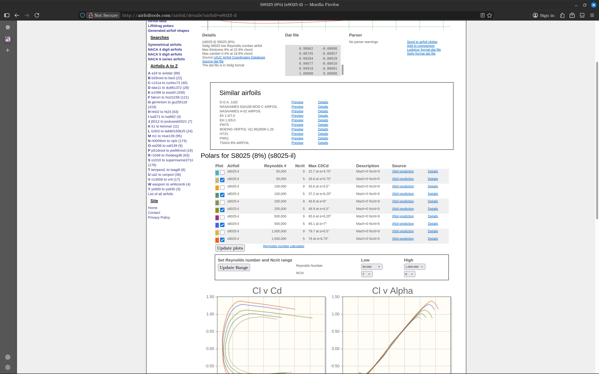

# Pinker Prop

Preliminary hover propeller sizing for small multirotors using actuator disk theory and blade element theory.

`Pinker Prop` is a compact Python project for estimating inflow velocity, spanwise thrust loading, relative flow conditions, chord distribution, angle of attack distribution, Reynolds number distribution, and geometric pitch distribution for a hover propeller concept.

It is built as a first-pass design tool: simple enough to move quickly, but grounded in the core physics needed to size a small propeller before moving into CAD, CFD, or testing.

The project is intentionally split in two layers:

- the physics in `pinker_prop.py` is purely human-built
- the UI in `pinker_prop_ui.py` is vibe coded
- the two are kept separate so interface changes do not overwrite the underlying aerodynamic model



## What It Does

Given a propeller diameter, hub diameter, vehicle mass, RPM, and blade discretization, the project:

- computes induced inflow velocity in hover from momentum theory
- distributes blade thrust along the span
- computes local relative velocity magnitude and inflow angle
- solves for the chord that satisfies the target elemental thrust at each radial station
- interpolates low-Reynolds airfoil data for the blade element calculation
- returns geometric pitch from local inflow angle and target angle of attack

The current implementation uses a single airfoil along the whole span and is aimed at hover analysis, not full forward-flight performance prediction.

## Project Structure

- [pinker_prop.py](pinker_prop.py)
  Core physics script. This is where the inflow, thrust distribution, blade element solver, and pitch calculation live. This is the human-built part of the project.
- [pinker_prop_ui.py](pinker_prop_ui.py)
  Desktop UI for running the same analysis without touching the physics logic. This is the vibe-coded layer wrapped around the separate solver.
- [Theoretical background:.md](Theoretical%20background:.md)
  Notes on the modeling assumptions and aerodynamic background.
- [BladeElementTheory.png](BladeElementTheory.png)
  Reference figure for blade element geometry.

## Quick Start

Requirements:

- Python 3
- standard library only for the physics script
- `tkinter` for the UI

Run the solver directly:

```bash
python3 pinker_prop.py
```

Run the interface:

```bash
python3 pinker_prop_ui.py
```

## Inputs

The current model is driven by:

- `outer_d`: propeller diameter
- `mass`: total quadrotor mass
- `hub_d`: hub diameter
- `blades`: number of blades
- `sections`: number of radial blade elements
- `motor_rpm`: rotational speed
- `bottom_bracket`: minimum chord used by the solver
- `top_bracket`: maximum chord used by the solver
- `exit_step`: local solver tolerance
- `y`: thrust distribution mode

Supported thrust distributions:

- `uniform`
- `ramp`

## Physics Approach

The project combines two main ideas:

1. Momentum theory for hover inflow
2. Blade element theory for local aerodynamic loading

The workflow is:

1. Compute required thrust per propeller from vehicle mass.
2. Estimate induced inflow velocity in hover.
3. Split blade thrust into radial elements.
4. Compute local relative velocity and inflow angle.
5. Use airfoil polar data and a bisection-style chord search to match target elemental thrust.
6. Recover geometric pitch from inflow angle and selected angle of attack.

## Current Assumptions

This is intentionally a simplified design tool. Current assumptions include:

- hover-only analysis
- incompressible flow
- one airfoil along the full blade span
- 2D sectional polar behavior used along the blade
- no induced angle correction from a lifting-line or vortex model
- no structural model
- no CAD generation in the current committed version

That means the code is useful for concept sizing and for understanding trends, but it is not a final-performance or manufacturing tool by itself.

## Why This Project Exists

The point of the project is not just to output numbers. It is to make the early propeller design loop faster:

- change geometry assumptions quickly
- see how loading shifts along the span
- estimate Reynolds-number regime before choosing hardware
- get a first chord and pitch distribution before deeper validation

## Roadmap

Good next steps for the project would be:

- cleaner module separation between physics and script execution
- support for multiple airfoils and more general polar interpolation
- stronger solver safeguards and bracket validation
- export of results to CSV
- CAD generation from the solved blade sections
- validation against experimental or CFD data

## Notes

The solver and UI were developed around a practical engineering workflow rather than a packaged Python library structure. That keeps iteration fast, but it also means the project is still evolving and benefits from cleanup as it grows.

One design choice matters more than the rest: the physics and the interface are deliberately kept separate. The aerodynamic logic stays in the solver file, while the UI is allowed to move faster and be more experimental without changing the core model.

If you want to use this as a GitHub landing page, a good short repository description would be:

`Hover propeller sizing with actuator disk theory and blade element theory in Python.`
