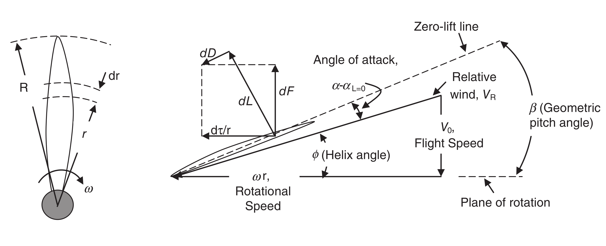

# **Theoretical background:**    
There are two classical approaches to propeller theory: momentum theory and blade element theory.  

---
## *MOMENTUM THEORY or ACTUATOR DISK THEORY*
In momentum theory we replace the propeller with a disk that creates a jump in angular momentum and static pressure.
Thrust is interpreted as the product of this jump in static pressure and the disk area.
This theory treats the flow as completely steady and the fluid is treated as incompressible and inviscid.
It allows to represent elegant ideal solutions for the ideal or upper limit of propeller performance.
We take two main equations from it:
+ $F_{\text{prop}}$ $\approx$ $\rho_0$ $V_p$ $A_p$ ($V_1$-$V_0$) 
(acts in a forward thrust direction)
+ $V_p$ $\approx$ 1/2 ($V_0$+$V_1$)
---
Now, as we are designing for drone hover conditions we know:
$V_0$ = 0; so we can get to:
+ $F_{\text{prop}}$ $\approx$ 2 $\rho_0$ $A_p$ $V_p$²

Now we have gotten everything we need from the momentum theory; we have a way of getting the axial induced velocity of the propeller in hover.

---
## *BLADE ELEMENT THEORY*
Another approach, based in classical airfoil and wing theory.
A propeller is a spinning twisted wing, the rotational speed increases linearly with distance from the axis of rotation.
The blade sections are subjected to *relative flow* in magnitude and angle; that is as seen by the blade element.
A propeller blade is composed of airfoil sections along its span that *see* the relative flow and create local aerodynamic forces and moments.  
The relative velocity $V_R$ at a blade element is the vector sum of the tangential blade speed and the axial flow velocity through the disk, which in hover is entirely induced.    
The relative flow angle is $\phi$ and is also called the helix angle.   
The aerodynamic lift on a blade element is proportional to the local effective angle of attack.
The basic blade element theory does not account for the induced angle of attack that is caused by 3D trailing vortices.
This means that, in a strict sense, the 3D performance of the propeller blade is constructed from the superposition of sectional 2D performance.    
The propeller parameters of interest, thrust and torque, are the integrals of the elemental thrust and torque along the blade span, these being to related to $\phi$ according to:  
$dF$ = $dL$ cos $\phi$ - $dD$ sin $\phi$   
$d\tau$ = r ($dL$ cos $\phi$ - $dD$ sin $\phi$)     
And the lift and drag forces being:     
$dL$ = 1/2 $\rho_0$ $V_R$² $c$ $C_l$    
$dD$ = 1/2 $\rho_0$ $V_R$² $c$ $C_d$

---
It is also important to take into account that the angle of attack $\alpha$ of the blade, which is the angle between chord and relative wind, will be governed by the difference between the geometric pitch $\beta$ and the inflow angle $\phi$ giving:    
$\alpha$ = $\beta$ - $\phi$

  

---
# DESIGN PROCESS:
Before moving to design, cfd and experimental validation we will begin with the pysical fundamentals using a python script to get the polars we need for a given airfoil.   
To keep things simple in this first approach, we will be using a single airfoil along the whole length, and varying cord and pitch, and uniform thrust and inflow distributions.
We begin by calculating inflow and our radial thrust distributions by discretizing the blade into a certain number of elements.

A propeller does not twist because it needs less lift locally.
It twists because the inflow angle changes with radius, and you want the angle of attack to stay near its design value everywhere, which changes depending on the reynolds along the blade.
## AIRFOIL SELECTION:
I selected the **S8025** airfoil because it is well suited for low Reynolds number operation, which matches the expected operating regime of a small multirotor propeller in hover. 
The airfoil was developed specifically for low-speed applications and offers stable lift behavior, reasonable lift-to-drag ratios, and well-documented geometry and aerodynamic polars, allowing the blade-element iteration to be carried out on a reliable and defensible basis.  
Other low-Re airfoils were considered, but many either exhibit sharper stall characteristics or lack sufficiently consistent data across the operating range of interest.   
Moreover, in this type of preliminary design the greatest efficiency gains are not expected to come from selecting an ideal airfoil, but from a correct adjustment of chord and operating angle of attack along the blade span, for which the S8025 provides a robust and conservative baseline.

--- 
Now we look the airfoil up in airfoil tools, we see that there is data for Ncrit = 9 or Ncrit = 5, we pick 5 as it is a "messier" environment, like that of a UAV prop.

---
## HOW POLARPICKER WORKS
This is my approach: 1. Set bracket for chord; 2. Get reynolds for lower bracktet; 3. Interpolate data to get optimal AoA, Cl and Cd 4. Calculate lift and drag for that section 5. Repeat 2,3,4 for upper bracket: 6. Repeat also for midpoint between brackets; 7. COmpare lift at each section with target lift, reject the furthest one; 8. We have a new bracket, we get midpoint and repeat process; 9. When exit criteria is met (step size as percentage of chord) finish and move to next section